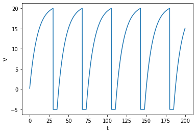
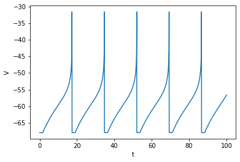
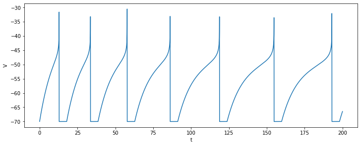
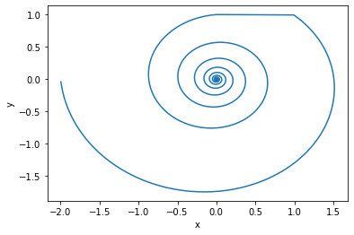
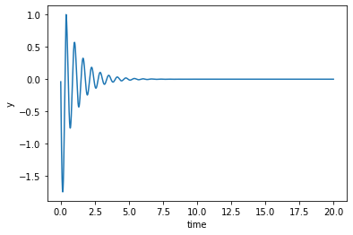
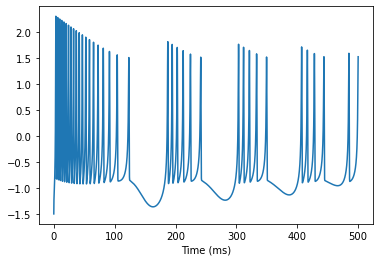

1.2 Reduced models

Inspired by biophysical experiments, Hodgkin-Huxley model is precise but costful. Researchers proposed the reduced models to reduce the consumption on computing resources and running time in simulation. 

These models are simple and easy to compute, while they can still reproduce the main pattern of neuron behavior. Although their representation capabilities are not as good as biophysical models, such a loss of accuracy is acceptable comparing to their simplicity.

### 1.2.1 Leaky Integrate-and-Fire model

The most typical reduced model is the Leaky Integrate-and-Fire model (LIF model) presented by Lapicque (1907).  LIF model can be seen as a combination of integrate process represented by differential equation and spike process represented by conditional judgment:

$$
\tau \frac{dV}{dt} = - (V - V_{rest}) + R I(t)
$$
If  $$V > V_{th}$$, neuron fire, 

$$
V \gets V_{reset}
$$
The `derivative` method of LIF model is simpler than of HH model. However the `update` method is more complex because of the conditional judgement.


```python
class LIF(bp.NeuGroup):
    target_backend = 'general'

    @staticmethod
    def derivative(V, t, Iext, V_rest, R, tau):
        dvdt = (-V + V_rest + R * Iext) / tau
        return dvdt

    def __init__(self, size, t_refractory=5., V_rest=0.,
                 V_reset=-5., V_th=20., R=1., tau=10., **kwargs):
        # parameters
        self.V_rest = V_rest
        self.V_reset = V_reset
        self.V_th = V_th
        self.R = R
        self.tau = tau
        self.t_refractory = t_refractory

        # variables
        num = bp.size2len(size)
        self.t_last_spike = bp.ops.ones(num) * -1e7
        self.input = bp.ops.zeros(num)
        self.V = bp.ops.ones(num) * V_rest
        self.refractory = bp.ops.zeros(num, dtype=bool)
        self.spike = bp.ops.zeros(num, dtype=bool)

        self.integral = bp.odeint(self.derivative)
        super(LIF, self).__init__(size=size, **kwargs)

    def update(self, _t):
        refractory = (_t - self.t_last_spike) <= self.t_refractory
        # if neuron is in refractory period
        V = self.integral(self.V, _t, self.input, self.V_rest, self.R, self.tau)
        V = bp.ops.where(refractory, self.V, V)
        spike = self.V_th <= V  # if neuron spikes
        self.t_last_spike = bp.ops.where(spike, _t, self.t_last_spike)
        self.V = bp.ops.where(spike, self.V_reset, V)
        self.refractory = refractory | spike
        self.input[:] = 0.
        self.spike = spike
```

Note that we write `update` method in vector form here. If the backend is `Numba`, we can also realize LIF model with `prange` loop, for `Numba` provides excellent parallel acceleration on `prange` loop:

    def update(self, _t):
        for i in prange(self.size[0]):
            spike = 0.
            refractory = (_t - self.t_last_spike[i] <= self.t_refractory)
            if not refractory:
                V = self.integral(self.V[i], _t, self.input[i], self.V_rest, self.R, self.tau)
                spike = (V >= self.V_th)
                if spike:
                    V = self.V_reset
                    self.t_last_spike[i] = _t
                self.V[i] = V
            self.spike[i] = spike
            self.refractory[i] = refractory or spike
            self.input[i] = 0.


```python
neu = LIF(100, monitors=['V', 'refractory', 'spike'])
net = bp.Network(neu)
net.run(duration=200., inputs=(neu, 'input', 21.))
bp.visualize.line_plot(neu.mon.ts, neu.mon.V,
                       xlabel="t", ylabel="V", show=True)
```





Compare to the HH model, LIF model does not model the spike period of action potentials, in which the membrane potential bursts.

### 1.2.2 Quadratic Integrate-and-Fire model

To persue higher representation capability, Latham et al. (2000) proposed Quadratic Integrate-and-Fire model, in which they add a second order term in differential equation so the neurons can generate spike better.

$$
\tau\frac{d V}{d t}=a_0(V-V_{rest})(V-V_c) + RI(t)
$$


```python
class QuaIF(bp.NeuGroup):
    target_backend = 'general'

    @staticmethod
    def derivative(V, t, I_ext, V_rest, V_c, R, tau, a_0):
        dVdt = (a_0 * (V - V_rest) * (V - V_c) + R * I_ext) / tau
        return dVdt

    def __init__(self, size, V_rest=-65., V_reset=-68.,
                 V_th=-30., V_c=-50.0, a_0=.07,
                 R=1., tau=10., t_refractory=0., **kwargs):
        # parameters
        self.V_rest = V_rest
        self.V_reset = V_reset
        self.V_th = V_th
        self.V_c = V_c
        self.a_0 = a_0
        self.R = R
        self.tau = tau
        self.t_refractory = t_refractory

        # variables
        num = bp.size2len(size)
        self.V = bp.ops.ones(num) * V_reset
        self.input = bp.ops.zeros(num)
        self.spike = bp.ops.zeros(num, dtype=bool)
        self.refractory = bp.ops.zeros(num, dtype=bool)
        self.t_last_spike = bp.ops.ones(num) * -1e7

        self.integral = bp.odeint(f=self.derivative, method='euler')

        super(QuaIF, self).__init__(size=size, **kwargs)

    def update(self, _t):
        refractory = (_t - self.t_last_spike) <= self.t_refractory
        V = self.integral(self.V, _t, self.input, self.V_rest,
                          self.V_c, self.R, self.tau, self.a_0)
        V = bp.ops.where(refractory, self.V, V)
        spike = self.V_th <= V
        self.t_last_spike = bp.ops.where(spike, _t, self.t_last_spike)
        self.V = bp.ops.where(spike, self.V_reset, V)
        self.refractory = refractory | spike
        self.input[:] = 0.
        self.spike = spike
```


```python
neu = QuaIF(100, monitors=['V', 'refractory', 'spike'])
net = bp.Network(neu)
net.run(duration=200., inputs=(neu, 'input', 21.))
bp.visualize.line_plot(neu.mon.ts, neu.mon.V,
                       xlabel="t", ylabel="V", show=True)
```


### 1.2.3 Exponential Integrate-and-Fire model
Exponential Integrate-and-Fire model (ExpIF model) (Fourcaud-Trocme et al., 2003) is more expressive than QuaIF model.

$$
\tau \frac{dV}{dt} = - (V - V_{rest}) + \Delta_T e^{\frac{V - V_T}{\Delta_T}} + R I(t)
$$


```python
class ExpIF(bp.NeuGroup):
    target_backend = 'general'

    @staticmethod
    def derivative(V, t, I_ext, V_rest, delta_T, V_T, R, tau):
        dvdt = (- V + V_rest \
                + delta_T * bp.ops.exp((V - V_T) / delta_T) + R * I_ext) \
               / tau
        return dvdt

    def __init__(self, size, V_rest=-65., V_reset=-68.,
                 V_th=-30., V_T=-59.9, delta_T=3.48,
                 R=10., C=1., tau=10., t_refractory=1.7,
                 **kwargs):
        # parameters
        self.V_rest = V_rest
        self.V_reset = V_reset
        self.V_th = V_th
        self.V_T = V_T
        self.delta_T = delta_T
        self.R = R
        self.C = C
        self.tau = tau
        self.t_refractory = t_refractory

        # variables
        self.V = bp.ops.zeros(size)
        self.input = bp.ops.zeros(size)
        self.spike = bp.ops.zeros(size, dtype=bool)
        self.refractory = bp.ops.zeros(size, dtype=bool)
        self.t_last_spike = bp.ops.ones(size) * -1e7

        self.integral = bp.odeint(self.derivative)
        super(ExpIF, self).__init__(size=size, **kwargs)

    def update(self, _t):
        refractory = (_t - self.t_last_spike) <= self.t_refractory
        V = self.integral(self.V, _t, self.input, self.V_rest, self.delta_T, self.V_T, self.R, self.tau)
        V = bp.ops.where(refractory, self.V, V)
        spike = self.V_th <= V
        self.t_last_spike = bp.ops.where(spike, _t, self.t_last_spike)
        self.V = bp.ops.where(spike, self.V_reset, V)
        self.refractory = refractory | spike
        self.input[:] = 0.
        self.spike = spike
```


```python
neu = ExpIF(16, monitors=['V', 'spike', 'refractory'])

neu.run(duration=100, inputs=('input', 1.))
bp.visualize.line_plot(neu.mon.ts, neu.mon.V,
                       xlabel="t", ylabel="V",
                       show=True)
```





With the model parameter $$V_T$$, ExpIF model reproduce the burst of membrane potential before action potentials.

### 1.2.4 Adaptive Exponential Integrate-and-Fire model

To reproduce the adaptation behavior of neurons, researchers add a weight variable w to existing integrate-and-fire models like LIF, QuaIF and ExpIF models. Here we introduce a typical one: Adaptative Exponential Integrate-and-Fire model (AdExIF model)(Gerstner et al, 2014).

$$
\tau_m \frac{dV}{dt} = - (V - V_{rest}) + \Delta_T e^{\frac{V - V_T}{\Delta_T}} - R w + R I(t)
$$

$$
\tau_w \frac{dw}{dt} = a(V - V_{rest})- w + b \tau_w \sum \delta(t - t^f))
$$

Facing a constant input, the firing rate of AdExIF neuron decreases over time. These adaptation is controlled by the weight variable w.


```python
class AdExIF(bp.NeuGroup):
    target_backend = 'general'

    @staticmethod
    def derivative(V, w, t, I_ext, V_rest, delta_T, V_T, R, tau, tau_w, a):
        dwdt = (a * (V - V_rest) - w) / tau_w
        dVdt = (- (V - V_rest) + delta_T * bp.ops.exp((V - V_T) / delta_T) - R * w + R * I_ext) / tau
        return dVdt, dwdt

    def __init__(self, size, V_rest=-65., V_reset=-68.,
                 V_th=-30., V_T=-59.9, delta_T=3.48,
                 a=1., b=1., R=10., tau=10., tau_w=30.,
                 t_refractory=0., **kwargs):
        # parameters
        self.V_rest = V_rest
        self.V_reset = V_reset
        self.V_th = V_th
        self.V_T = V_T
        self.delta_T = delta_T
        self.a = a
        self.b = b
        self.R = R
        self.tau = tau
        self.tau_w = tau_w
        self.t_refractory = t_refractory

        # variables
        num = bp.size2len(size)
        self.V = bp.ops.ones(num) * V_reset
        self.w = bp.ops.zeros(size)
        self.input = bp.ops.zeros(num)
        self.spike = bp.ops.zeros(num, dtype=bool)
        self.refractory = bp.ops.zeros(num, dtype=bool)
        self.t_last_spike = bp.ops.ones(num) * -1e7

        self.integral = bp.odeint(f=self.derivative, method='euler')

        super(AdExIF, self).__init__(size=size, **kwargs)

    def update(self, _t):
        refractory = (_t - self.t_last_spike) <= self.t_refractory
        V, w = self.integral(self.V, self.w, _t, self.input, self.V_rest,
                             self.delta_T, self.V_T, self.R, self.tau,
                             self.tau_w, self.a)
        V = bp.ops.where(refractory, self.V, V)
        spike = self.V_th <= V
        self.t_last_spike = bp.ops.where(spike, _t, self.t_last_spike)
        self.V = bp.ops.where(spike, self.V_reset, V)
        self.w = bp.ops.where(spike, w + self.b, w)
        self.refractory = refractory | spike
        self.input[:] = 0.
        self.spike = spike
```


```python
import brainpy as bp

backend = 'numpy'
bp.backend.set(backend=backend, dt=.005)

duration = 200
I_ext = 65
neu = AdExIF(size=1, monitors=['V', 'spike', 'refractory'],
             a=.5, b=7, R=.5, tau=9.9, tau_w=100,
             V_reset=-70, V_rest=-70, V_th=-30,
             V_T=-50, delta_T=2., t_refractory=5.)

neu.run(duration, inputs=('input', I_ext))
fig, gs = bp.visualize.get_figure(1, 1, 4, 10)
bp.visualize.line_plot(neu.mon.ts, neu.mon.V,
                       xlabel="t", ylabel="V")

```





### 1.2.5 Resonate-and-Fire model

Other than the integrators we introduced above, there is another neuron type called resonator. From Fig.1-12 we may see, resonators' membrane potentials oscillate under the threshold potential when there is no spike, that's the reason resonators prefer rhythm inputs than high frequency inputs.

<center> </center>

<center><b>Fig.1-12 Integrator vs. Resonator</b></center>

This sub-threshold oscillations of resonators are caused by the interactions between ion channels. To model the oscillations, Izhikevich and Eugene (2001) proposed Resonate-and-Fire model (RF model) which includes two model variables x, y to represent the current-like and voltage-like variables in neurons.

$$
\frac{dx}{dt} = bx - wy
$$

$$
\frac{dy}{dt} = wx + by
$$

When spike,

$$
x \gets 0, y \gets 1
$$


```python
class ResonateandFire(bp.NeuGroup):
    target_backend = 'general'

    @staticmethod
    def derivative(y, x, t, b, omega):
        dydt = omega * x + b * y
        dxdt = b * x - omega * y
        return dydt, dxdt

    def __init__(self, size, b=-1., omega=10.,
                 V_th=1., V_reset=1., x_reset=0.,
                 **kwargs):
        # parameters
        self.b = b
        self.omega = omega
        self.V_th = V_th
        self.V_reset = V_reset
        self.x_reset = x_reset

        # variables
        self.y = bp.ops.zeros(size)
        self.x = bp.ops.zeros(size)
        self.input = bp.ops.zeros(size)
        self.spike = bp.ops.zeros(size, dtype=bool)

        self.integral = bp.odeint(self.derivative)
        super(ResonateandFire, self).__init__(size=size, **kwargs)

    def update(self, _t):
        x = self.x + self.input
        y, x = self.integral(self.y, x, _t, self.b, self.omega)
        sp = (y > self.V_th)
        y[sp] = self.V_reset
        x[sp] = self.x_reset
        self.y = y
        self.x = x
        self.spike = sp
        self.input[:] = 0
```


```python
bp.backend.set('numpy', dt=0.002)
group = ResonateandFire(1, monitors=['x', 'y'], show_code=False)
current = bp.inputs.spike_current(points=[0.0], lengths=0.002,
                                  sizes=-2., duration=20.)
group.run(duration=20., inputs=('input', current))
bp.visualize.line_plot(
    group.mon.x, group.mon.y, 
    xlabel = 'x', ylabel = 'y',
    show=True)
bp.visualize.line_plot(
    group.mon.ts, group.mon.y, 
    xlabel = 'time', ylabel = 'y',
    show=True)
```








After a short stimulus is given, paint the trajectory of x and y on complex field, we can see the both variables decaying to zero in a nearly circle trajectory. The voltage-like variable y acts like a resonator here.

### 1.2.6 Hindmarsh-Rose model

To simulate the bursting spike pattern in neurons (i.e. continuously firing in a short time period), Hindmarsh and Rose (1984) proposed Hindmarsh-Rose neuron model, import a third model variable as slow variable to control the bursting of neuron.

$$
\frac{d V}{d t} = y - a V^3 + b V^2 - z + I
$$

$$
\frac{d y}{d t} = c - d V^2 - y
$$

$$
\frac{d z}{d t} = r (s (V - V_{rest}) - z)
$$


```python
class HindmarshRose(bp.NeuGroup):
    target_backend = 'general'

    @staticmethod
    def derivative(V, y, z, t, a, b, I_ext, c, d, r, s, V_rest):
        dVdt = y - a * V * V * V + b * V * V - z + I_ext
        dydt = c - d * V * V - y
        dzdt = r * (s * (V - V_rest) - z)
        return dVdt, dydt, dzdt

    def __init__(self, size, a=1., b=3.,
                 c=1., d=5., r=0.01, s=4.,
                 V_rest=-1.6, **kwargs):
        # parameters
        self.a = a
        self.b = b
        self.c = c
        self.d = d
        self.r = r
        self.s = s
        self.V_rest = V_rest

        # variables
        self.z = bp.ops.zeros(size)
        self.input = bp.ops.zeros(size)
        self.V = bp.ops.ones(size) * -1.6
        self.y = bp.ops.ones(size) * -10.

        self.integral = bp.odeint(self.derivative)
        super(HindmarshRose, self).__init__(size=size, **kwargs)

    def update(self, _t):
        self.V, self.y, self.z = self.integral(self.V, self.y, self.z, _t,
                                               self.a, self.b, self.input,
                                               self.c, self.d, self.r, self.s,
                                               self.V_rest)
        self.input[:] = 0.
```


```python
import brainpy as bp

bp.backend.set('numba', dt=0.02)
mode = 'irregular_bursting'
param = {'quiescence': [1.0, 2.0],  # a
         'spiking': [3.5, 5.0],  # c
         'bursting': [2.5, 3.0],  # d
         'irregular_spiking': [2.95, 3.3],  # h
         'irregular_bursting': [2.8, 3.7],  # g
         }
# set params of b and I_ext corresponding to different firing mode
print(f"parameters is set to firing mode <{mode}>")

group = HindmarshRose(size=10, b=param[mode][0],
                                          monitors=['V', 'y', 'z'])

group.run(500., inputs=('input', param[mode][1]))
bp.visualize.line_plot(group.mon.ts, group.mon.V, show=True)
```

    parameters is set to firing mode <irregular_bursting>





In the variable-t plot below, the three model variables x, y, z change on time. Variable z changes much slower than x and y, so it is the slow variable.

We should mention that x and y are changing periodically during the simulation. Can BrainPy help us analysis the reason of this periodicity?


```python
mode = 'spiking'
print(f"parameters is set to firing mode <{mode}>")
group = HindmarshRose(size=10, b=param[mode][0],
                      monitors=['V', 'y', 'z'])
group.run(100., inputs=('input', param[mode][1]))
fig, gs = bp.visualize.get_figure(1, 1, 4, 10)
fig.add_subplot(gs[0, 0])
bp.visualize.line_plot(group.mon.ts, group.mon.V, legend = 'V')
bp.visualize.line_plot(group.mon.ts, group.mon.y, legend = 'y')
bp.visualize.line_plot(group.mon.ts, group.mon.z, legend = 'z', show=True)
```

    parameters is set to firing mode <spiking>


Yes. With the module `analysis` of BrainPy, users can do simple dynamic analysis, including 1D/2D bifurcation analysis, fast-slow variable bifurcation analysis and 2D/3D phase plane drawing.

Here we take 2D phase plane drawing as an example. Passing the differential eqution, target variables, fixed variables and parameters to `PhasePlane` class in `analysis` module, we can instantiate a PhasePlane analyzer object based on differential equation.


```python
# Phase plane analysis
ppanalyzer = bp.analysis.PhasePlane(
    neu.integral,
    target_vars = {'V': [-3., 3.], 'y': [-20., 5.]},
    fixed_vars = {'z': 0.},
    pars_update = {'I_ext':param[mode][1], 'a': 1., 'b': 3., 
                   'c': 1., 'd': 5., 'r': 0.01, 's': 4.,
                   'V_rest': -1.6}
)
ppanalyzer.plot_nullcline()
ppanalyzer.plot_fixed_point()
ppanalyzer.plot_vector_field()
ppanalyzer.plot_trajectory(
    [{'V': 1., 'y': 0., 'z': -0.}],
    duration=100., 
    show=True
)
```

<center></center>

Call the `plot_nullcline`, `plot_vector_field`, `plot_fixed_point`, `plot_trajectory` method of phase plane analyzer, users can paint nullcline, vector filed, fixed points and trajectory of the dynamic system.

In HR model, the trajectory of x and y approaches a limit cycle, that’s why these two variables change periodically.

### 1.2.7 Generalized Integrate-and-Fire model

Generalized Integrate-and-Fire model (GIF model)(Mihalaş et al., 2009) integrates several firing patterns in one model. With 4 model variables, it can generate more than 20 types of firing patterns, and is able to alternate between patterns by fitting parameters.

$$
\frac{d I_j}{d t} = - k_j I_j, j = {1, 2}
$$

$$
\tau \frac{d V}{d t} = ( - (V - V_{rest}) + R\sum_{j}I_j + RI)
$$

$$
\frac{d V_{th}}{d t} = a(V - V_{rest}) - b(V_{th} - V_{th\infty})
$$

When V meet Vth, Generalized IF neuron fire:

$$
I_j \leftarrow R_j I_j + A_j
$$

$$
V \leftarrow V_{reset}
$$

$$
V_{th} \leftarrow max(V_{th_{reset}}, V_{th})
$$


```python
class GeneralizedIF(bp.NeuGroup):
    target_backend = 'general'

    @staticmethod
    def derivative(I1, I2, V_th, V, t,
                   k1, k2, a, V_rest, b, V_th_inf,
                   R, I_ext, tau):
        dI1dt = - k1 * I1
        dI2dt = - k2 * I2
        dVthdt = a * (V - V_rest) - b * (V_th - V_th_inf)
        dVdt = (- (V - V_rest) + R * I_ext + R * I1 + R * I2) / tau
        return dI1dt, dI2dt, dVthdt, dVdt

    def __init__(self, size, V_rest=-70., V_reset=-70.,
                 V_th_inf=-50., V_th_reset=-60., R=20., tau=20.,
                 a=0., b=0.01, k1=0.2, k2=0.02,
                 R1=0., R2=1., A1=0., A2=0.,
                 **kwargs):
        # params
        self.V_rest = V_rest
        self.V_reset = V_reset
        self.V_th_inf = V_th_inf
        self.V_th_reset = V_th_reset
        self.R = R
        self.tau = tau
        self.a = a
        self.b = b
        self.k1 = k1
        self.k2 = k2
        self.R1 = R1
        self.R2 = R2
        self.A1 = A1
        self.A2 = A2

        # vars
        self.input = bp.ops.zeros(size)
        self.spike = bp.ops.zeros(size, dtype=bool)
        self.I1 = bp.ops.zeros(size)
        self.I2 = bp.ops.zeros(size)
        self.V = bp.ops.ones(size) * -70.
        self.V_th = bp.ops.ones(size) * -50.

        self.integral = bp.odeint(self.derivative)
        super(GeneralizedIF, self).__init__(size=size, **kwargs)

    def update(self, _t):
        I1, I2, V_th, V = self.integral(
            self.I1, self.I2, self.V_th, self.V, _t,
            self.k1, self.k2, self.a, self.V_rest,
            self.b, self.V_th_inf,
            self.R, self.input, self.tau)
        sp = (self.V_th < V)
        V[sp] = self.V_reset
        I1[sp] = self.R1 * I1[sp] + self.A1
        I2[sp] = self.R2 * I2[sp] + self.A2
        reset_th = np.logical_and(V_th < self.V_th_reset, sp)
        V_th[reset_th] = self.V_th_reset
        self.spike = sp
        self.I1 = I1
        self.I2 = I2
        self.V_th = V_th
        self.V = V
        self.input[:] = 0.
```


```python
import matplotlib.pyplot as plt
import numpy as np

size=10
mode = "hyperpolarization_induced_bursting"
neu = GeneralizedIF(size, monitors=['V', 'V_th', 'I1', 'I2', 'input'])
neu.V_th_reset = -60.
neu.V_th_inf = -120.
neu.A1 = 10.
neu.A2 = -0.6
neu.V_th = bp.ops.ones(size) * -50.
I_ext, dur = bp.inputs.constant_current([(-1., 400.)])
neu.run(duration = dur, inputs=('input', I_ext), report=False)

ts = neu.mon.ts
fig, gs = bp.visualize.get_figure(1, 1, 4, 8)
ax1 = fig.add_subplot(gs[0, 0])
ax1.title.set_text(f'{mode}')

ax1.plot(ts, neu.mon.V[:, 0], label='V')
ax1.plot(ts, neu.mon.V_th[:, 0], label='V_th')
ax1.set_xlabel('Time (ms)')
ax1.set_ylabel('Membrane potential')
ax1.set_xlim(-0.1, ts[-1] + 0.1)
plt.legend()

ax2 = ax1.twinx()
ax2.plot(ts, I_ext, color='turquoise', label='input')
ax2.set_xlabel('Time (ms)')
ax2.set_ylabel('External input')
ax2.set_xlim(-0.1, ts[-1] + 0.1)
ax2.set_ylim(-5., 20.)
plt.legend(loc='lower left')

plt.show()
```


