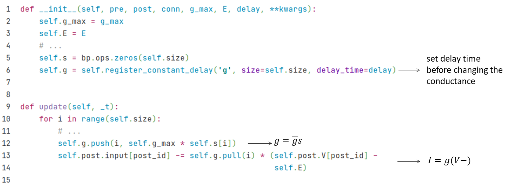
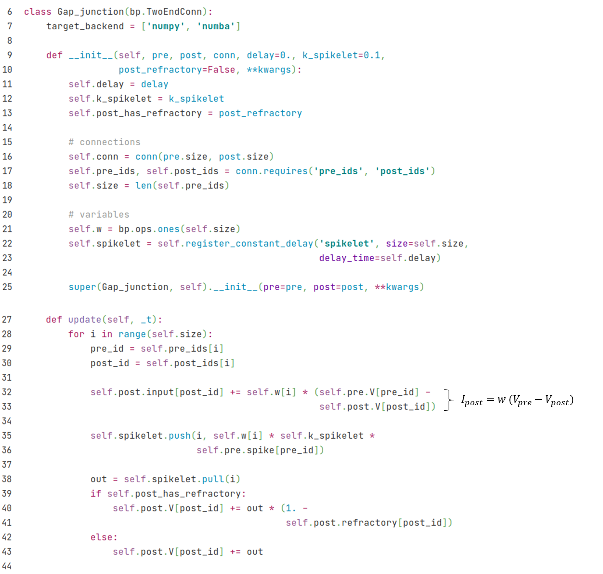

## 2.1 Synaptic Models

In the previous section, we learned how to model neurons and their action potentials. In this section, we will focus on how neurons communicate.

### 2.1.1 Chemical Synapses

#### Biological Background

Fig. 2-1 shows the biological process of information transmission between neurons. The action potential of the presynaptic neuron makes the axon terminal release **neurotransmitters** (also called transmitters) into the synaptic cleft, and then the membrane potential of the postsynaptic cell changes after a brief delay. These changes are called postsynaptic potentials (PSP), and they can be either excitatory or inhibitory depending on the type of transmitter. **Glutamate** is one of the important excitatory neurotransmitters, and Gamma-aminobutyric acid (**GABA**) is one of the important inhibitory neurotransmitters.

Neurotransmitters affect their targets by interacting with receptors on the postsynaptic membrane. When the transmitter binds to the receptor, it would either open an ion channel (**ionotropic** receptors) or alter chemical reactions within the target cell (**metabotropic** receptors).

In this section, we will introduce how to model some common synapses and their implementations with ``BrainPy``:

- **AMPA** and **NMDA** receptors are both ionotropic receptors of Glutamate, but the NMDA receptor are typically blocked by magnesium ions (Mg$$^{2+}$$) and cannot respond to the glutamate. With repeated activation of AMPA receptors, the change in postsynaptic potential drives Mg$$^{2+}$$ out of NMDA channel, then the NMDA receptors are able to respond to glutamate. Therefore, the dynamics of NMDA is much slower than that of AMPA.

- **GABA<sub>A</sub>** and **GABA<sub>B</sub>** are two classes of GABA receptors. GABA<sub>A</sub> receptors are ionotropic, typically producing fast inhibitory postsynaptic potential; while GABA<sub>B</sub> receptors are metabotropic receptors, typically producing a slow-occurring inhibitory postsynaptic potential.


<div style="text-align:center">
  
  <br>
    <strong> Fig. 2-1 Biological Synapse </strong> (Adapted from <cite  id="reffn_1">Gerstner et al., 2014 <sup><a href="#fn_1">1</a></sup></cite>)
</div>
<div><br></div>

In order to keep things simple, we use gating variable ``s`` to describe how many portion of ion channels will open whenever a presynaptic spike arrives while modeling. We will first introduce AMPA receptor as an example to show how to develop synapse models and implement them with ``BrainPy``.


#### AMPA Synapse

As we mentioned before, the AMPA receptor is an ionotropic receptor, that is, when a neurotransmitter binds to it, the ion channel will be opened immediately to allow Na$$^+$$ and K$$^+$$ ions flux.

We can use Markov process to describe the opening and closing process of ion channels. As shown in Fig. 2-2,  $$s$$ represents the probability of channel opening, $$1-s$$ represents the probability of ion channel closing, and $$\alpha$$ and $$\beta$$ are the transition probability. Because neurotransmitters can open ion channels, the transfer probability from $$1-s$$ to $$s$$ is affected by the concentration of neurotransmitters. We denote the concentration of neurotransmitters as [T].

<div style="text-align:center">
   
  <br>	
  <strong> Fig. 2-2 Markov process of channel dynamics </strong>
</div>
<div><br></div>

We obtained the following formula when describing the process by a differential equation.

$$
\frac {ds}{dt} = \alpha [T] (1-s) - \beta s
$$

Where $$\alpha [T]$$ denotes the transition probability from state $$(1-s)$$ to state $$(s)$$; and $$\beta$$ represents the transition probability of the other direction.

Now let's see how to implement such a model with BrainPy. First of all, we need to define a class that inherits from `` bp.TwoEndConn ``, because synapses connect two neurons. Within the class, we can define the differential equation with ``derivative`` function, this is the same as the definition of neuron models. Then we use the ``__ init__ `` Function to initialize the required parameters and variables.


We update $$s$$ by an ``update`` function.


After the implementation, we can plot the graph of $$s$$ changing with time. We would first write a ``run_syn`` function to run and plot the graph. To run a synapse, we need neuron groups, so we use the LIF neuron provided by ``brainmodels`` package.


Then we would expect to see the following result:


As can be seen from the above figure, when the presynaptic neurons fire, the value of $$s$$ will first increase, and then decay.

#### Alpha、Exponential Synapses

Because many synaptic models have the same dynamic characteristics as AMPA synapses, sometimes we don't need to use models that specifically correspond to biological synapses. Therefore, some abstract synaptic models have been proposed. Here, we will introduce the implementation of four abstract models on BrainPy. These models can also be found in the ``Brain-Models`` package.

##### (1) Differences of two exponentials

Let's first introduce the ``Differences of two exponentials`` model, its dynamics is given by,

$$
s = \frac {\tau_1 \tau_2}{\tau_1 - \tau_2} (\exp(-\frac{t - t_s}{\tau_1})
- \exp(-\frac{t - t_s}{\tau_2}))
$$

Where $$t_s$$ denotes the spike timing of the presynatic neuron, $$\tau_1$$ and $$\tau_2$$ are time constants.

While implementing with BrainPy, we use the following differential equation form,
$$
		\frac {ds} {dt} = x
$$

$$
 \frac {dx}{dt} =- \frac{\tau_1+\tau_2}{\tau_1 \tau_2}x - \frac s {\tau_1 \tau_2}
$$

$$
\text{if (fire), then} \ x \leftarrow x+ 1
$$

Here we specify the logic of increment of $$x$$ in the ``update`` function when the presynaptic neurons fire. The code is as follows:


Then we expect to see the following result:


##### (2) Alpha synapse

Dynamics of ``Alpha synapse`` is given by, 
$$
s = \frac{t - t_s}{\tau} \exp(-\frac{t - t_s}{\tau})
$$
As the dual exponential synapse,  $$t_s$$ denotes the spike timing of the presynaptic neuron, with a time constant $$\tau$$.

The differential equation form of alpha synapse is also very similar with the dual exponential synapses, with $$\tau = \tau_1 = \tau_2$$, as shown below:
$$
\frac {ds} {dt} = x
$$

$$
 \frac {dx}{dt} =- \frac{2x}{\tau} - \frac s {\tau^2}
$$

$$
\text{if (fire), then} \ x \leftarrow x+ 1
$$

Code implementation is similar:


Then we expect to see the following result:


##### (3) Single exponential decay

Sometimes we can ignore the rising process in modeling, and only need to model the decay process. Therefore, the formula of ``single exponential decay`` model is more simplified:

$$
\frac {ds}{dt}=-\frac s {\tau_{decay}}
$$

$$
\text{if (fire), then} \ s \leftarrow s+1
$$

The implementing code is given by:


Then we expect to see the following result:


##### (4) Voltage jump

Sometimes even the decay process can be ignored, so there is a ``voltage jump`` model, which is given by:

$$
\text{if (fire), then} \ s \leftarrow s+1
$$

The code is as follows:


Then we expect to see the following result:


#### Current-based and Conductance-based synapses

So far, we have modeled the gating variable $$s$$, now let's see how to model the effect of the gating variables on the synaptic current. The current that passes through a synaptic channel is denoted as $$I$$. There are two different methods to model the relationships between $$s$$ and $$I$$: **current-based** and **conductance-based**. The main difference between them is whether the synaptic current is influenced by the membrane potential of postsynaptic neurons.

##### (1) Current-based

The formula of the current-based model is as follow:

$$
I \propto s
$$

While coding, we usually multiply $$s$$ by a weight $$w$$. We can implement excitatory and inhibitory synapses by adjusting the positive and negative values of the weight $$w$$.

The delay of synapses is implemented by applying the delay time to the ``I_syn`` variable using the ``register_constant_delay`` function provided by BrainPy.


##### (2) Conductance-based

In the conductance-based model, the conductance is $$g=\bar{g} s$$. Therefore, according to Ohm's law, the formula is given by:
$$
I=\bar{g}s(V-E)
$$

Here $$E$$ is a reverse potential, which can determine whether the effect of $$I$$ is inhibition or excitation. For example, when the resting potential is about -65, subtracting a lower $$E$$, such as -75, will become positive, thus will change the direction of the current in the formula and produce the suppression current. The $$E$$ value of excitatory synapses is relatively high, such as 0.

In terms of implementation, you can apply a synaptic delay to the variable ``g``.




### 2.1.2 Electrical Synapses

In addition to the chemical synapses described earlier, electrical synapses are also common in our neural system.

<div  style="text-align:center">
    <div style="display:grid;grid-template-columns: 1fr 3fr 1fr 3fr;grid-template-rows:1fr 3fr;justify-items:center;align-items:center">
      <div style="grid-column:1;grid-row:1;align-self:end;justify-self:end">
        <strong>(a)</strong>
      </div>
      <div style="grid-column:2;grid-row:2">
        
      </div>
      <div style="grid-column:3;grid-row:1;align-self:end;justify-self:end">
        <strong>(b)</strong>
      </div>
      <div style="grid-column:4;grid-row:2">
        
      </div>
    </div>
  <br>
  <strong> Fig. 2-3 (a)</strong> Gap junction connection between two cells. 
  <strong>(b)</strong> An equivalent diagram. 
  <br>(From <cite  id="reffn_2">Sterratt et al., 2011 <sup><a href="#fn_2">2</a></sup></cite>)
</div>
<div><br></div>

As shown in the Fig. 2-3a, two neurons are connected by junction channels and can conduct electricity directly. Therefore, it can be seen that two neurons are connected by a constant resistance, as shown in the Fig. 2-3b.

According to Ohm's law, the current of one neuron is given by,

$$
I_{1} = w (V_{0} - V_{1})
$$

where $$V_0$$ and $$V_1$$ are the membrane potentials of the two neurons, and the synaptic weight $$w$$ is equivalent with the conductance.

While implementing with BrainPy, you only need to specify the equation in the ``update`` function.



Then we can run a simulation.


```python
import matplotlib.pyplot as plt
import numpy as np

neu0 = bm.neurons.LIF(2, monitors=['V'], t_refractory=0)
neu0.V = np.ones(neu0.V.shape) * -10.
neu1 = bm.neurons.LIF(3, monitors=['V'], t_refractory=0)
neu1.V = np.ones(neu1.V.shape) * -10.
syn = Gap_junction(k_spikelet=5., pre=neu0, post=neu1, 
                   conn=bp.connect.All2All())
syn.w = np.ones(syn.w.shape) * .5

net = bp.Network(neu0, neu1, syn)
net.run(100., inputs=(neu0, 'input', 30.))

fig, gs = bp.visualize.get_figure(row_num=2, col_num=1, )

fig.add_subplot(gs[1, 0])
plt.plot(net.ts, neu0.mon.V[:, 0], label='V0')
plt.legend()

fig.add_subplot(gs[0, 0])
plt.plot(net.ts, neu1.mon.V[:, 0], label='V1')
plt.legend()
plt.show()
```


### References

[^1]: Gerstner, Wulfram, et al. Neuronal dynamics: From single neurons to networks and models of cognition. Cambridge University Press, 2014.
[^2]: Sterratt, David, et al. Principles of computational modeling in neuroscience. Cambridge University Press, 2011.

