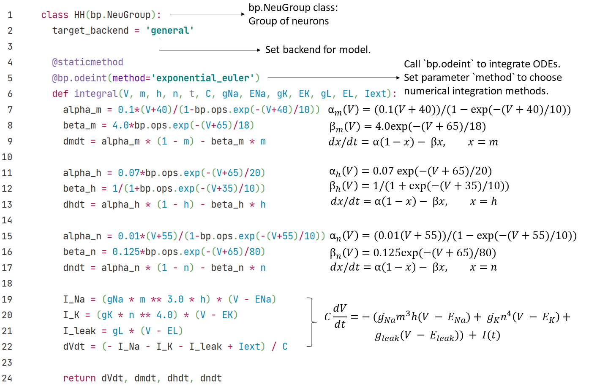
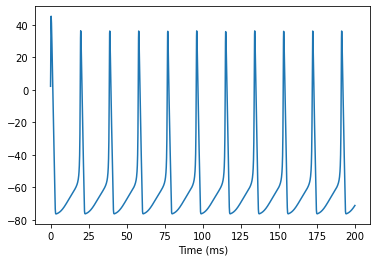

## 1.2 生理模型

### 1.2.1 Hodgkin-Huxley模型

Hodgkin和Huxley（1952）在枪乌贼的巨轴突上用膜片钳技术记录了动作电位的产生，并提出了经典的神经元模型**Hodgkin-Huxley模型**（**HH模型**）。

上一节我们已经介绍了细胞膜的一般性模板。Hodgkin和Huxley将神经元细胞膜建模为等效电路，如下图所示。

	

<b>Fig. 1-4 Equivalent circuit diagram | NeuroDynamics </b>

图1-4中所示的，是将图1-1中真实神经元膜转换为电子元件所得到的等效电路图。在图1-4中，电容$$C$$表示电导率很低的疏水性磷脂双层膜，电流$$I$$表示外界刺激。

由于钠离子通道和钾离子通道在动作电位的形成中非常重要，这两个离子通道被单独建模为电路图右侧所示的两个并联的可变电阻$$R_{Na}$$和$$R_K$$，而电阻$$R$$代表膜上所有非特定的离子通道。电源 $$E_{Na}$$, $$E_K$$ 和$$E_L$$对应着由相应离子的浓度差所引起的电位差。

考虑基尔霍夫第一定律，即，对于电路中的任一点，流入该点的总电流和流出该点的总电流相等，图1-4可被建模为如下所示的微分方程：
$$
C \frac{dV}{dt} = -(\bar{g}_{Na} m^3 h (V - E_{Na}) + \bar{g}_K n^4(V - E_K) + g_{leak}(V - E_{leak})) + I(t)
$$

$$
\frac{dx}{dt} = \alpha_x(1-x) - \beta_x , x \in \{ Na, K, leak \}
$$

这就是HH模型。注意在如上的第1个方程中，右侧的前三项分别代表穿过钠离子通道，钾离子通道和其他非特定离子通道的电流，同时$$I(t)$$表示一个外部输入。在方程左侧，$$C\frac{dV}{dt} = \frac{dQ}{dt} = I$$是穿过电容的电流。

在计算经过离子通道的电流时，除了欧姆定律$$I = U/R = gU$$之外，HH模型还引入了三个**门控变量**m、n和h来控制离子通道的打开/关闭状态。准确的说，变量m和h控制着钠离子通道的状态，变量n控制着钾离子通道的状态，并且，一个离子通道的真实电导是其最大电导$$\bar{g}$$和通道门控变量状态的乘积。

门控变量的动力学可以被表示为一种类马尔可夫的形式，其中$$\alpha_x$$代表门控变量$$x$$的激活速率，而$$\beta_x$$代表$$x$$的失活速率。$$\alpha_x$$和$$\beta_x$$的公式（如下所示）是由实验数据拟合得到的。
$$
\alpha_m(V) = \frac{0.1(V+40)}{1 - exp(\frac{-(V+40)}{10})}
$$

$$
\beta_m(V) = 4.0 exp(\frac{-(V+65)}{18})
$$

$$
\alpha_h(V) = 0.07 exp(\frac{-(V+65)}{20})
$$

$$
\beta_h(V) = \frac{1}{1 + exp(\frac{-(V + 35)}{10})}
$$

$$
\alpha_n(V) = \frac{0.01(V+55)}{1 - exp(\frac{-(V+55)}{10})}
$$

$$
\beta_n(V) = 0.125 exp(\frac{-(V+65)}{80})
$$

*在我们的github仓库中运行代码:：https://github.com/PKU-NIP-Lab/BrainModels（如无特殊说明，下同）*

BrainPy仿真的HH模型的V-t图如下所示。真实神经元产生动作电位的三个阶段，去极化、复极化和不应期都可以对应到下图中。另外在去极化时，HH模型的膜电位先是缓慢积累外部输入，一旦其值高于某个特定值，膜电位就转为快速增长，这也复现了真实动作电位的形状。

