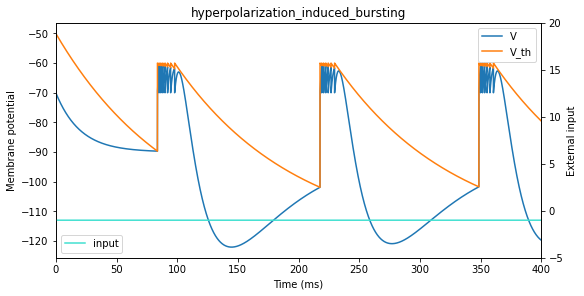

## 1.3 简化模型

启发自生理实验的Hodgkin-Huxley模型准确但昂贵。研究者们提出了简化模型，希望能降低仿真的运行时间和计算资源的消耗。

简化模型简单、易于计算，并且他们仍然能够复现神经元发放的主要特征。尽管它们的表示能力不如生理模型，但和它们的简便相比，在特定场景下研究者们有时也可以接受一定的精度损失。

### 1.3.1 泄漏积分-发放模型

最经典的简化模型，莫过于Lapicque（1907）提出的**泄漏积分-发放模型**（Leaky Integrate-and-Fire model, **LIF model**）。LIF模型是由微分方程表示的积分过程和由条件判断表示的发放过程的结合：
$$
\tau\frac{dV}{dt} = - (V - V_{rest}) + R I(t)
$$
If  $$V > V_{th}$$, neuron fires, 
$$
V \gets V_{reset}
$$
$$\tau = RC$$是LIF模型的时间常数，$$\tau$$越大，模型的动力学就越慢。如上所示的方程对应于一个比HH模型的等效电路图更加简单的等效电路，因为它不再建模钠离子通道和钾离子通道。实际上，LIF模型中只有电阻$$R$$，电容$$C$$，电源$$E$$和外部输入$$I$$被建模。

<b>Fig1-4 Equivalent circuit of LIF model</b>

比起HH模型，LIF模型没有建模动作电位的形状，也就是说，在发放一个峰电位之前，LIF神经元的膜电位不会骤增。并且在原始模型中，不应期也被忽视了。为了仿真模拟不应期，必须再补充一个条件判断：

如果
$$
t-t_{last spike}<=refractory period
$$
则神经元处在不应期中，膜电位$$V$$不再更新。

### 1.3.2 二次积分-发放模型

为了追求更强的表示能力，Latham等人（2000）提出了**二次积分-发放模型**（Quadratic Integrate-and-Fire model，**QuaIF model**），他们在微分方程的右侧添加了一个二阶项，使得神经元能产生更好的动作电位。
$$
\tau\frac{d V}{d t}=a_0(V-V_{rest})(V-V_c) + RI(t)
$$

在上式中，$$a_0$$是控制着膜电位发放前的斜率的参数，$$V_c$$是动作电位初始化的临界值。当低于 $$V_C$$时，膜电位 $$V$$缓慢增长，一旦越过 $$V_C$$， $$V$$就转为迅速增长。

### 1.3.3 指数积分-发放模型
**指数积分发放模型**（Exponential Integrate-and-Fire model,  **ExpIF model**）（Fourcaud-Trocme et al., 2003）的表示能力比QuaIF模型更强。ExpIF模型在微分方程右侧增加了指数项，使得模型现在可以产生更加真实的动作电位。
$$
\tau \frac{dV}{dt} = - (V - V_{rest}) + \Delta_T e^{\frac{V - V_T}{\Delta_T}} + R I(t)
$$

在指数项中$$V_T$$是动作电位初始化的临界值，在其下$$V$$缓慢增长，其上$$V$$迅速增长。$$\Delta_T$$是ExpIF模型中动作电位的斜率。当$$\Delta_T\to 0$$时，ExpIF模型中动作电位的形状将等同于$$V_{th} = V_T$$的LIF模型（Fourcaud-Trocme et al.，2003）。

### 1.3.4 适应性指数积分-发放模型

当面对恒定的外部刺激时，神经元一开始高频发放，随后发放率逐渐降低，最终稳定在一个较小值，这种现象生物上称为**适应**。

为了复现神经元的适应行为，研究者们在已有的积分-发放模型，如LIF、QuaIF和ExpIF模型上增加了权重变量w。这里我们介绍其中一个经典模型，**适应性指数积分-发放模型**（Adaptive Exponential Integrate-and-Fire model，**AdExIF model**）（Gerstner et al.，2014）。
$$
\tau_m \frac{dV}{dt} = - (V - V_{rest}) + \Delta_T e^{\frac{V - V_T}{\Delta_T}} - R w + R I(t)
$$

$$
\tau_w \frac{dw}{dt} = a(V - V_{rest})- w + b \tau_w \sum \delta(t - t^f))
$$

就如它的名字所示，AdExIF模型的第一个微分方程和我们上面介绍的ExpIF模型非常相似，不同的是适应项，即方程中$$-Rw$$这一项。

权重项$$w$$受到第二个微分方程的调控。$$a$$描述了权重变量$$w$$对$$V$$的下阈值波动的敏感性，$$b$$表示$$w$$在一次发放后的增长值，并且$$w$$也会随时间衰减。

给神经元一个恒定输入，在连续发放几个动作电位之后，$$w$$的值将会上升到一个高点，减慢$$V$$的增长速度，从而降低神经元的发放率。

### 1.3.5 Hindmarsh-Rose模型

为了模拟神经元中的**爆发式发放**（bursting，即在短时间内的连续发放），Hindmarsh和Rose（1984）提出了**Hindmarsh-Rose模型**，引入了第三个模型变量$$z$$作为慢变量来控制神经元的爆发。
$$
\frac{d V}{d t} = y - a V^3 + b V^2 - z + I
$$

$$
\frac{d y}{d t} = c - d V^2 - y
$$

$$
\frac{d z}{d t} = r (s (V - V_{rest}) - z)
$$

The $$V$$ variable refers to membrane potential, and $$y$$, $$z$$ are two gating variables. The parameter $$b$$ in $$\frac{dV}{dt}$$ equation allows the model to switch between spiking and bursting states, and controls the spiking frequency. $$r$$ controls slow variable $$z$$'s variation speed, affects the number of spikes per burst when bursting, and governs the spiking frequency together with $$b$$. The parameter $$s$$ governs adaptation, and other parameters are fitted by firing patterns.

变量$$V$$表示膜电位，$$y$$和$$z$$是两个门控变量。在$$dV/dt$$方程中的参数$$b$$允许模型在发放和爆发两个状态之间切换，并且控制着发放的频率。参数$$r$$控制着慢变量$$z$$的变化速度，影响着神经元爆发式发放时，每次爆发包含的动作电位个数，并且和$$b$$一起统筹控制发放频率，参数$$s$$控制着适应行为。其它参数根据发放模式拟合得到。

	

在下图中，画出了三个变量随时间的变化，可以看到慢变量$$z$$的改变要慢于$$V$$和$$y$$。而且，$$V$$和$$y$$在仿真过程中呈周期性变化。

利用BrainPy的理论分析模块`analysis`，我们可以分析出这种周期性的产生原因。在模型的相图中，$$V$$和$$y$$的轨迹趋近于一个极限环，因此他们的值会沿着极限环发生周期性的改变。

### 1.3.6 归纳积分-发放模型

**归纳积分-发放模型**（Generalized Integrate-and-Fire model，**GeneralizedIF model**）（Mihalaş et al.，2009）整合了多种发放模式。该模型拥有四个模型变量，能产生多于20种发放模式，并可以通过调整参数在各模式之间切换。

$$
\frac{d I_j}{d t} = - k_j I_j, j = {1, 2}
$$

$$
\tau \frac{d V}{d t} = ( - (V - V_{rest}) + R\sum_{j}I_j + RI)
$$

$$
\frac{d V_{th}}{d t} = a(V - V_{rest}) - b(V_{th} - V_{th\infty})
$$

当$$V$$达到$$V_{th}$$时，GeneralizedIF模型发放：
$$
I_j \leftarrow R_j I_j + A_j
$$

$$
V \leftarrow V_{reset}
$$

$$
V_{th} \leftarrow max(V_{th_{reset}}, V_{th})
$$

在$$dV/dt$$的方程中，和所有积分-发放模型一样，$$\tau$$表示时间常数，$$V$$表示膜电位，$$V_{rest}$$表示静息电位，$$R$$为电阻，而$$I$$为外部输入。 

不过，在GIF模型中，数目可变的内部电流被加入到方程中，写作$$\sum_j I_j$$一项。每一个$$I_j$$都代表神经元中的一个内部电流，并以速率$$k_j$$衰减。$$R_j$$和$$A_j$$是自由参数，$$R_j$$描述了$$I_j$$的重置值对发放前的$$I_j$$的值的依赖，$$A_j$$是在发放后加到$$I_j$$上的一个常数值。

可变的阈值电位$$V_{th}$$受两个参数的调控：$$a$$ 描述了$$V_{th}$$对膜电位$$V$$ 的依赖，$$b$$描述了$$V_{th}$$接近阈值电位在时间趋近于无穷大时的值$$V_{th_{\infty}}$$的速率。$$V_{th_{reset}}$$是当神经元发放时，阈值电位被重置到的值。

	

	

